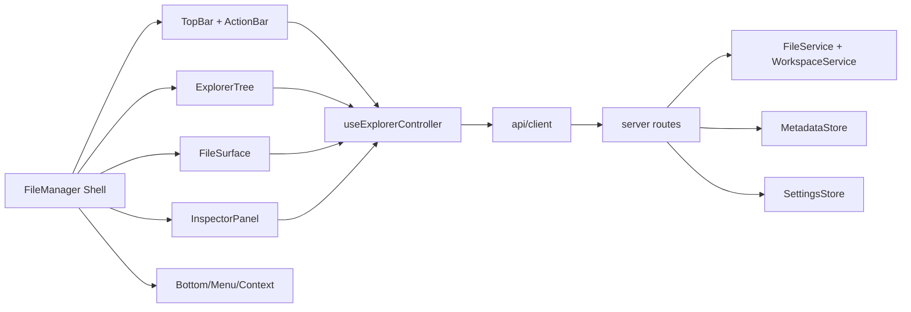

# Webbox Explorer Core Design

## Goal

Implement the first delivery slice of the Webbox file manager rewrite: make the explorer shell behave like a real Kodbox-style file manager while keeping Webbox standalone, single-user, and free of login/user/department/share/history features.

This slice focuses on:

- Left recursive directory tree and fixed-height shell layout.
- Two-row top navigation and toolbar.
- Breadcrumb path editing with safe abstract paths.
- Favorites, recent files, inline creation/rename, sorting, icon sizing, download behavior, and multi-select.
- Inspector panel layout and memo/activity interaction polish.
- Theme/language persistence and UI menu behavior.
- Resource naming cleanup from `kodbox` to `webbox` in Webbox-owned code and paths.
- Runtime logging fix so PowerShell output remains copyable and does not alter terminal font.

The full admin center and network mount drivers are defined as integration boundaries in this spec, but their complete feature implementation belongs to the next delivery slice unless a dependency is required for Explorer Core.

## Current Findings

The current Webbox implementation has enough backend primitives to build on, but the UI is still prototype-shaped:

- `apps/web/src/components/FileManager.tsx` owns navigation, toolbar, file listing, context menus, safe-box dialog, notifications, and admin modal state in one component.
- `NavigationTree.tsx` only renders section headers plus second-level buttons. It is not a recursive tree and cannot expand/collapse root categories.
- `FileGrid.tsx` supports grid/list rendering but no type column, sorting, inline rename, box selection, shift range selection, or file icon scaling.
- `InspectorPanel.tsx` is functional but not layout-correct: preview is outside the panel, tabs are buttons, activity can grow the page, and memo attachment/emoji/markdown controls are missing.
- `WorkspaceService` still enumerates local disks/root under network mounts, which must be removed for safety.
- `MetadataStore` already persists theme, language, favorites, memos, activity, plugins, and safe-box password metadata, but preferences such as icon size, search history, and admin upload/download settings do not exist yet.
- Build output currently copies resources from `assets/kodbox` into `webbox-assets/kodbox`; both Webbox-owned paths should be renamed so new code no longer exposes `kod`/`kodbox` naming.

## Architecture

Explorer Core should introduce a small set of focused models and services rather than expanding the current large files.



New frontend units:

- `ExplorerController` hook: centralizes current location, history stack, selected paths, sort/view/icon preferences, search state, and command handlers.
- `ExplorerTree`: recursive, collapsible tree with scrollable body and fixed footer area.
- `ExplorerTopBar`: back/forward, safe breadcrumb, editable path field, favorite star, search box with recent-search dropdown.
- `ExplorerActionBar`: refresh, upload dropdown, download, new dropdown, view switch, icon-size slider, sort dropdown, inspector toggle, safe-box lock button.
- `FileSurface`: list/grid file rendering, sorting headers, box selection, inline create/rename input.
- `InspectorPanel`: preview-in-panel, tab strip, properties/memos/activity panes.

New or extended backend units:

- `SettingsStore`: persists `.config/settings.json` for UI preferences, upload/download settings, search history limit, theme, language, and icon size.
- `FavoriteService` or metadata extensions: stores favorite paths and exposes add/remove/list APIs.
- `RecentService` or activity query helper: derives recently touched files from activity records and exposes them as virtual file items.
- `PathResolver`: maps abstract Webbox paths such as `/个人空间/我的文档/test` to safe `(space, path)` pairs without accepting real local paths, `..`, Windows drive prefixes, UNC paths, or encoded traversal.
- `Download route`: sets `Content-Disposition: attachment` unless a preview endpoint explicitly requests inline display.

## Layout Design

The shell must be viewport-locked:

```text
┌────────────────────────────────────────────────────────────────────────────┐
│ Tree  │ Back Forward │ /个人空间 / 我的文档 / ...     [search          ] │
│       │ Refresh Upload Download New View Size Sort Inspector             │
│       ├───────────────────────────────────────────────┬──────────────────┤
│       │ File surface, full-height, independently      │ Inspector        │
│       │ scrollable list/grid                          │ preview + tabs   │
│       │                                               │ fixed height     │
│       │                                               │ scroll panes     │
│       ├───────────────────────────────────────────────┴──────────────────┤
│ Note  │                                                                    │
│ Menu  │                                                                    │
└────────────────────────────────────────────────────────────────────────────┘
```

CSS requirements:

- Root shell: `height: 100vh; overflow: hidden`.
- Left tree: fixed width, `display: grid; grid-template-rows: auto 1fr auto`.
- Tree list: `overflow-y: auto; min-height: 0`.
- Bottom notification/menu strip: fixed at bottom of left pane. Notification button remains square; menu button fills remaining width.
- Workspace: `display: grid; grid-template-rows: auto auto 1fr`.
- File surface and inspector: `min-height: 0; overflow: auto`.
- No panel height may grow because of activity records, memos, or tree expansion.

## Directory Tree Behavior

The tree returned by `/api/tree` must match this shape:

```text
位置
  收藏夹
  个人空间
    私密保险箱
    我的相册
    我的文档
    我的音乐
    我的视频
工具
  最近文档
  私密保险箱
  回收站
网络挂载
  新增网络挂载
  configured local/webdav/ftp mounts only
```

Rules:

- `位置`、`工具`、`网络挂载` are first-class clickable tree nodes.
- Clicking a group node opens a virtual folder in the file surface showing its children as folder tiles.
- Expanding/collapsing a node only changes list length, never tree pane height.
- Local disks/root are never auto-discovered or displayed.
- Local mounts must be configured outside the web UI, from `server.conf` or `.config/mounts.json`.
- `新增网络挂载` opens a dialog for webdav/ftp only. If the first slice does not implement full driver access, it must store disabled mount definitions and show a clear “driver not enabled” state rather than pretending to work.

## Path Model

The UI should not expose or accept raw filesystem paths.

Abstract paths:

- `/位置`
- `/位置/收藏夹`
- `/位置/个人空间`
- `/位置/个人空间/我的文档/test`
- `/工具/最近文档`
- `/工具/回收站`
- `/网络挂载/<挂载名>/folder`

The resolver maps abstract paths to:

```ts
interface ResolvedLocation {
  kind: "space" | "virtual" | "recycle" | "mount";
  displayPath: string;
  space?: "personal" | "photos" | "documents" | "music" | "videos" | "safe";
  filePath?: string;
  virtualId?: string;
  mountId?: string;
}
```

Validation rejects:

- Empty path except `/`.
- `..` segments after URL decoding.
- Backslashes as path separators.
- Windows drive prefixes such as `C:`.
- UNC paths such as `\\server\share`.
- Double slashes that imply absolute real paths.
- Control characters and reserved Windows device names when creating/renaming.

Breadcrumb behavior:

- Renders each path segment as a button.
- Clicking a segment jumps to that ancestor.
- Clicking the reserved blank area switches to editable input.
- Pressing Enter resolves and navigates.
- Invalid input shows a Webbox message panel and restores the prior path.

## Top Navigation And Toolbar

Row 1:

- Back button.
- Forward button.
- Breadcrumb path control.
- Favorite star. It is active when the current resolved location is favorited.
- Search field. Press Enter searches current scope. Recent searches drop down below the field.

Search:

- Recent searches are persisted in settings.
- Maximum recent-search count is configurable in admin settings, default 10.
- Search history stores text and scope, not raw local paths.

Row 2:

- Refresh.
- Upload dropdown:
  - Upload files.
  - Upload folder, using `<input type="file" webkitdirectory directory multiple>`.
- Download.
- New dropdown:
  - Folder.
  - `txt`, `md`, `html`, `docx`, `xlsx`, `pptx`.
- View mode toggle: grid/list.
- Icon size button: opens slider and persists continuously.
- Sort dropdown: name/type/size/modified, ascending/descending.
- Inspector toggle.
- Safe-box lock button appears when current location is safe-box or safe space is unlocked.

New document templates:

- `txt`, `md`, `html`: plain text templates.
- `docx`, `xlsx`, `pptx`: minimal OpenXML zip templates generated server-side or copied from internal templates.
- After creation, file surface enters inline rename mode on the new item.

## File Surface Behavior

List mode:

- Columns: name, type, size, modified time.
- Headers are clickable and toggle ascending/descending.
- Long names must ellipsize within the name cell and never overlap other columns.

Grid mode:

- Icon size comes from persisted setting.
- Icon tiles use real Webbox asset icons by extension/type.
- Box selection works by drag rectangle.

Selection:

- Click selects one item.
- Ctrl/Cmd toggles item.
- Shift extends from anchor item to clicked item.
- Drag box selects intersecting items.
- Inspector receives all selected items. For multi-select it shows total file count, folder count, and aggregate size.

Inline create/rename:

- No `window.prompt`.
- The target tile/row name becomes an input.
- Enter commits, Escape cancels.
- Invalid filename produces an in-app alert/modal, restores original value, and keeps rename mode active unless user cancels.
- Server validates the same filename rules to avoid client-only safety.

Download:

- The UI creates an anchor with `download` and clicks it.
- Server sends `Content-Disposition: attachment`.
- Preview uses a separate inline URL or explicit `preview=1`.

Favorites and recent:

- Favorite star toggles current path.
- File context menu can favorite/unfavorite selected files/folders.
- Favorites virtual folder lists favorite targets and opens their real location.
- Recent documents derive from activity and open real locations.

## Inspector Panel

Panel:

- Has its own show/hide toggle.
- Occupies full height of workspace content area.
- Preview appears at the top only when exactly one previewable file is selected.
- Preview closes automatically when selection changes to non-previewable or multi-select.

Tabs:

- Use one connected segmented/tab strip: 属性 / 备忘录 / 动态.
- Tabs do not change panel height.

Properties:

- Shows single selection details or multi-selection summary.
- Tag input is above tag description.

Memos:

- Text area supports Markdown mode.
- Toolbar buttons: emoji, image upload, attachment upload, markdown toggle.
- Attachments are stored by backend and listed under the memo.
- First slice stores attachments, lists them under each memo, and renders image attachments as thumbnails when the MIME type starts with `image/`.

Activity:

- Fixed-height scroll list.
- Querying current directory returns direct and child operations.
- New records do not resize layout.

## Menus And Notifications

Context menu:

- Render as a normal menu list, not rounded button cards.
- Supports nested submenus for New, More, and plugin actions.
- Removed menus stay removed: edit lock, quick external share, shortcut creation, desktop shortcut, history/share entries.

Bottom menu:

- Notification and menu popovers are mutually exclusive.
- Menu is a list with entries: 后台管理, 插件管理, 多语言, 主题样式.
- Theme/language controls apply immediately and persist.

Notification panel:

- Fixed width.
- Content wraps.
- “标记已读” button is full panel width.
- No horizontal scrolling.

## Admin Boundary For This Slice

Explorer Core must add enough settings infrastructure for:

- Theme.
- Language.
- Icon size.
- View mode.
- Sort mode.
- Search history limit.
- Upload settings schema with persisted defaults for chunk size, concurrency, ignore patterns, retry count, download speed limit, frontend zip toggle, and backend zip size limit.
- Storage path settings already present.

Full admin implementation for overview/statistics, backup/restore, operation-log export, plugin installation/uninstall, and mount driver management will be a second implementation slice. Explorer Core should expose stable API shapes for these future screens where necessary, but should not implement incomplete fake features.

## Resource And Naming Cleanup

Webbox-owned code and paths must remove `kod`/`kodbox` naming.

Required moves:

- `assets/kodbox/*` -> `assets/*` or `assets/webbox/*`.
- Build output `webbox-assets/kodbox/*` -> `webbox-assets/*` or `webbox-assets/webbox/*`.
- `uiAssets` and CSS references update to new paths.

Plugin internals are compatibility payloads. Do not rewrite plugin file contents unless loaded code directly breaks Webbox, because original plugin packages may contain class names or identifiers required by their own scripts.

Login cleanup:

- Remove login images from Webbox-owned asset output if unused.
- Do not include original login page images or login scripts in Webbox UI.
- Keep avatar/user icons only if used for the local single-user menu and renamed/placed under Webbox assets.

## Build And Runtime Logging

PowerShell launchers must not change the terminal font or make output non-copyable.

Design:

- Avoid setting `[Console]::OutputEncoding` in runtime scripts if it causes host font changes.
- Prefer Node-side UTF-8 log tee:
  - Node process writes normal terminal output.
  - Logger writes the same records to `WEBBOX_LOG_FILE`.
  - PowerShell does not pipe native process output through formatting cmdlets during runtime.
- Build scripts may still set UTF-8 for log file correctness, but runtime scripts should be conservative.
- `run-webbox.ps1` keeps Node in the foreground so Ctrl+C stops backend immediately.

## Testing Strategy

Unit/API tests:

- Path resolver rejects traversal, drive prefixes, UNC paths, control characters, and reserved filenames.
- SettingsStore persists theme/language/icon/search preferences under `.config`.
- Favorites and recent APIs return openable abstract locations.
- Download route sets attachment disposition.
- WorkspaceService no longer auto-enumerates local roots.

Frontend tests:

- Recursive tree expands/collapses groups and clicking group shows child folder entries.
- Breadcrumb segment click and manual path entry work.
- Search Enter stores recent history.
- Inline rename validates and commits without `window.prompt`.
- Multi-select summary appears in inspector.
- Theme and language menu apply and persist.

Build/runtime tests:

- `build.ps1` default does not run tests.
- `build.ps1 -Test` runs tests.
- Output contains web and server artifacts.
- Runtime script starts server, serves built UI, and leaves no Node process after termination.
- Build/runtime scripts contain no hardcoded external source paths.

Dynamic smoke:

- Build in `H:\oplus\kodbox\webbox-test`.
- Run generated deployment script from `out`.
- Open `/`, verify React UI not fallback.
- Create folder, create template file, rename inline, favorite path, search, download, inspect selection, lock/unlock safe-box.
- Stop script and assert no Webbox node backend remains.

## Acceptance Criteria For Slice 1

- The left tree matches the requested hierarchy and is fully collapsible/scrollable.
- The file manager, tree, and inspector occupy the full viewport height without layout growth.
- Top navigation and action bars match the requested two-row model.
- Prompt-based create/rename/search flows are replaced.
- Sorting, icon size persistence, favorites, recent documents, downloads, and multi-select work.
- Inspector preview/tabs/memos/activity layout behaves as requested.
- Theme and language switching are functional and persisted.
- Webbox-owned asset paths no longer use `kod` or `kodbox`.
- Build/runtime scripts have no external source dependency and runtime PowerShell output remains normal.
